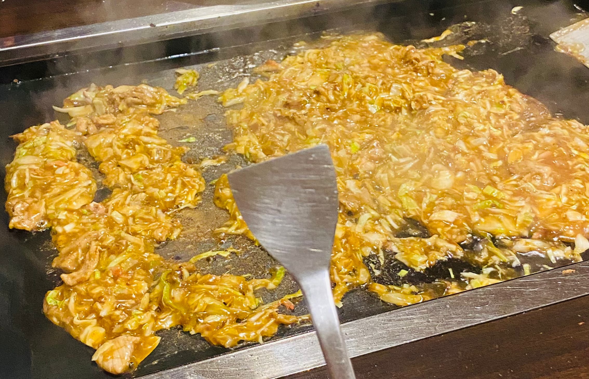

從一月訂完機票到現在，終於可以出境了，我可是期盼著這一天期盼好久啊！
因為研發替代役的關係，六月以前我無法離境，如今終於可以踏上久違的海外旅程。
而且 2 月的時候，還去成功嶺受訓一個月，那時候還理了頭髮，

當初在討論行程的時候，我就跟大家要求要可以睡到飽再出發的時間 XD，
於是最後是定了 CX450 的班機（13:00 TPE - NRT）。

我跟我女友從台北出發，在台北車站的時候就辦理了登機手續，然後把寄艙的行李寄出去了。
兩手空空的搭著機場捷運，然後在第一航廈的 B1 悠閒的吃午餐，等待其他從南投出發的夥伴。

原本以為排隊過安檢會花一點時間，沒有想到不到 10 分鐘就通過安檢進了離境大廳了。
上了飛機之後，在我座位前面那區的空姐實在可愛，英文的口音我也很喜歡，
很可惜的是她負責的區域沒有包括我的位置。

出發前，我看了不少文章與評價，也問了親戚與同事，
大家一致認為國泰航空的飛機餐不太好吃。
但這次的宮保雞丁其實蠻符合我的胃口的。

到了日本之後，我們才在通道旁的廁所方便了一下，
結果進到入境關卡的時候，才發現大排長龍，
想到上次跟旅行團的時候，導遊說過的話，
他要我們一下飛機直奔入境關卡，要上廁所的忍一下，
出來還有很多機會可以上，回想起來才知道原來是有道理的。

我們在排隊入關的時候，女朋友突然說前面的人，好像是同校的朋友，
這也是首次有了「他鄉遇故知」的感受，雖然不是什麼故知，知的不是我 >W<

出了關卡之後，開始憑著手機的導航開始探索方向，同一個地方一定要來回走個好幾遍，
這才是自由行的精髓所在，好不容易找到通往 Airbnb 的火車路線，算是完成了抵達東京的第一個任務。

<!-- 這次我們選擇搭乘 Sky Aces 的路線，經過青砥轉車，最後抵達了京成立石站。 -->
<!-- 步行回住宿的途中，經過一條充滿在地風情的商店街， -->
<!-- 與常見的觀光景點風格大異其趣，街道氛圍樸實自然，別有一番風味。 -->

到了民宿之後發現，門口的玄館算是很小的，原本覺得可能會是壅擠的房屋，
也是沒有想到上到二樓之後是如此的寬敞，二樓的客廳與餐桌是聯通的，
廚房個一整片類似櫥窗的隔層，但沒有大片玻璃，而是直接可以伸手說過去的。

我們休息一下之後，就徒步到附近找吃的，後來看到了一家文字燒([もん字屋](https://maps.app.goo.gl/ehm4w1MFWexFhZtc7))，
這間餐廳跟許多動漫中的場景有點像，
店家只會把食材準備好，剩下的是需要自己動手處理這些料理的，
店員看到我們是外國人，特地親切地前來示範製作方式。

圍著中間的鐵板，一邊處理著食物，一邊聊天的感覺很棒，
還有各種沒有包手的同行友人展現廚藝，
享受一下日本人下班之後的生活。

吃完之後，在附近的街道走走，看著沿路上的日本建築，
晚上涼爽的天氣，實在令人放鬆。由於晚餐吃的不多，
我們到附近的便利商店買了泡麵，真心覺得日本的泡麵吃起來味道比較豐富。

OK 時間也不早了，我該去睡覺了！期待明天的行程。
