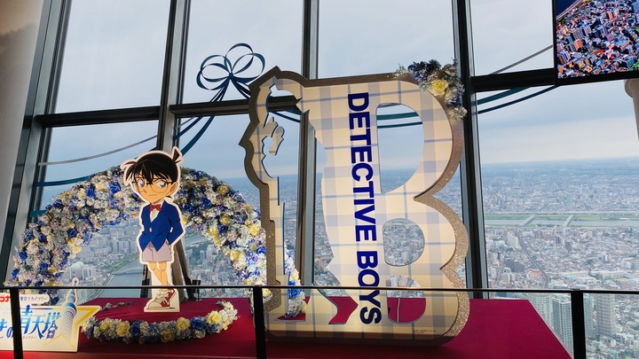

原本以為今天要輕鬆一點，沒想到不知哪來的動力，大家居然不只準時，
甚至還提早集合，直接往淺草出發。
事後證明，早起真的是正確的選擇 —— 抵達時仲見世通上的人還不多，
陽光斜斜地灑在兩旁的老店鋪上，整條街都透著一種寧靜的美感。
這個時間來拍照，完美。

我們先隨意逛了逛，邊走邊拍照，然後決定先去填飽肚子。
走到附近一家老派的咖啡店 ——「[咖啡老舖 友路有 淺草店](https://maps.app.goo.gl/CyQVn8HDhVj73Eqj9)」。
店內布置滿滿的昭和風味，像是走進時光隧道。
我點了一份簡單的早餐套餐：熱奶茶、厚片吐司加上一顆煎蛋。
味道不複雜，但卻溫暖人心，
有種「真的醒在日本」的感覺——彷彿動畫裡咬著吐司衝出門的場景突然成真了。

## 雷門淺草寺

但就在我們悠閒吃著早餐的短短 30 分鐘裡，外頭的世界瞬間變了樣。
剛走進咖啡店時，外頭還是陽光斜灑、行人稀疏，
一副平日早晨的模樣，結果等我們一轉身準備離開，
整條仲見世通已經擠得水洩不通。觀光客像是突然從地下冒出來似的，
整條街瞬間被熱鬧與喧囂吞沒。原本還覺得自己像當地人一樣優雅漫步，
下一秒就被人潮推進了觀光模式，節奏直接切換。

我們跟著隊伍般的觀光人流慢慢移動，邊走邊拍照，邊吃邊看，一路晃到了淺草寺主殿。
這些場景在無數的電影、動漫當中出現，現在終於身在其中，雖然在螢幕上看過無數次，
但當我親身走到它底下抬頭仰望時，心中還是無比的悸動。
那份熟悉卻又陌生的震撼，好像某個長久以來只存在於畫面裡的夢境，突然穿越次元落到了現實世界。
那一刻，旅程有了一種特別的重量，

帶著這份悸動，我們一路跟著人潮走進了主殿。香火裊裊，莊嚴的氣氛與外頭的熱鬧形成鮮明對比，讓人忍不住放慢腳步。
就在大家準備離開時，有人突然提議：「要不要來求個籤？」
眾人立刻點頭同意，興致勃勃地排隊抽籤。
我和女友各自搖動竹筒，心裡帶著點小小的期待。
打開籤盒的那一瞬間，
場面卻意外戲劇化——同行的四位朋友全都是「吉」，只有我們情侶檔雙雙「凶」。
接著笑聲四起，大家紛紛拿著自己的「吉籤」在我們面前比來比去，完全沒有要安慰的意思。
當下我和女友真的只有被嘲笑的份。

## 墨田水族館

晴空塔的樓層裡有各種購物、美食，還有不少娛樂設施。
其中四樓特別設有一座小巧卻精緻的水族館。
因為前陣子大熱的動畫《莉可莉絲》曾在這裡取景，
我們也特地把這個地方列進行程。

雖然這個水族館不大，但卻是我非常喜歡的行程。
一走進昏暗的空間，耳邊只有輕柔的水聲和低沉音樂，
下一刻映入眼簾的，是一群微微發著鮮豔光的水母，
像漂浮在夜空中的小燈籠，優雅而夢幻。
不確定水母是自己發光，還是因為小燈的映照，
但整個畫面美得讓人屏息。
微微發亮的水母在昏暗的空間裡悠悠漂浮，彷彿置身於深黑的深海
，眼前是那些奇妙、會發光的生物在水中舞動。
那種幽藍光影與寧靜感交織的氛圍，讓人完全忘記時間，只想靜靜看著它們優雅地遊動。

## 東京晴空塔

傍晚，我們搭乘高速電梯直上東京晴空塔的觀景台。
站在觀景台上俯瞰整個城市。
一次就能同時看到白天與夜晚的景色，城市的燈光逐漸亮起，河面倒映著點點燈火，
整個東京像被無數小星星點綴。微風輕拂，夜色與燈海交織，
白天的悠閒漫步與水族館的靜謐，在此刻都得到了完美的收束，令人既興奮又心滿意足。

在觀景台上方的天望回廊，正展出名偵探柯南特展。
迴廊兩側整排貼滿了角色海報，每個角色都栩栩如生。
站在這裡，不禁想到東京晴空塔在名偵探柯南中多次登場的場景：動畫裡的玻璃曾被開了數槍、千瘡百孔
我和女友忍不住開始討論起柯哀和新蘭哪對CP更有魅力，她力挺新蘭的甜蜜互動，我則支持柯哀的默契與細膩情感。

## 在民宿的晚餐

晚餐，我們在附近的超市買了一些特價的即期食材，回到民宿自己動手開煮。
不得不說，同行好友的手藝實在不錯，香氣四溢，味道也十分驚喜。
我和女友幾乎沒有下過廚，看著他們熟練地操作食材，
忍不住感嘆：這樣的手藝，他們怎麼還沒找到另一半呢？
邊吃邊笑鬧，這頓簡單的晚餐反而成了我們這天旅程中最溫馨、有趣的時刻之一。
