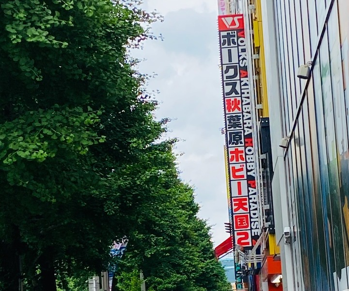
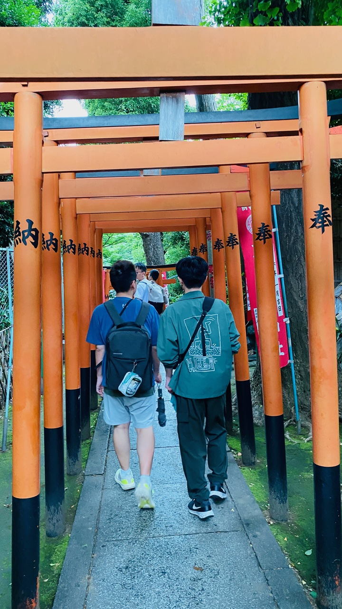
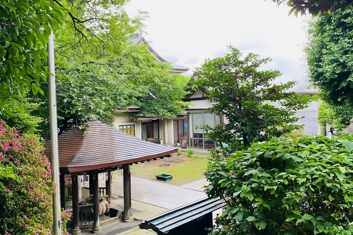
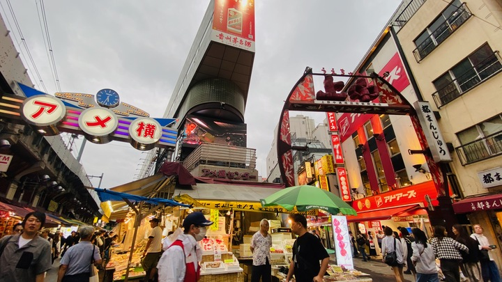

昨天真的走到腿快斷，大家一回到民宿就像被抽乾電力的手機，全員累翻。
原本規劃好八點出門，但現實總是比計畫殘酷，一路拖到將近九點半，才終於集合完畢，緩緩出發。
今天的行程，是特別替同行的宅宅好友量身打造的，你大概也猜到了──沒錯，重點就是秋葉原！

我們大約在上午十一點抵達秋葉原車站。接近中午，肚子也開始抗議，原本打算去吃漢堡排，但一看到門口排隊的人著，立刻放棄，轉戰旁邊百貨公司覓食。
結果餐廳雖然不用排隊，但餐點的表現完全沒有驚喜，甚至有點空虛——花了不少錢，卻吃不出相對應的價值感，讓人覺得心裡空空的。

## 秋葉原

吃完飯後，我們正式展開秋葉原的探險。沿著街道走，每間店裡都塞滿各種動漫周邊，扭蛋機更是無處不在，幾乎每個角落都能看到轉動的聲音與驚喜的表情。
路邊偶爾會遇到 Coser 派發宣傳單，不過我們這群宅宅顯然「恥力」不足，誰也不敢踏進女僕咖啡廳，只能遠遠看著。

這時，我女友的「海賊王雷達」全程開啟，只要看到相關周邊，眼睛就會瞬間發亮。但向來精打細算的她，仍然克制住購物衝動，直到在某間店裡發現一款特別的拼圖——
由無數角色照片拼湊成的大圖。那一刻，她終於忍不住下手，提著戰利品笑得像個孩子，臉上滿是滿足感。

最後，我們來到了一家大型夾娃娃機店，氣氛瞬間變得熱血起來。同行的好友直接開啟「夾娃娃修羅場」模式，從各種動漫公仔到模型，全都成了他們的目標。
沒多久，他們戰果滿滿，提袋都快裝不下，看起來就像剛打完一場夾娃娃副本。
而我呢？運氣還不錯，只花了 200 日圓就順利夾到一隻超可愛的卡比，
還在女友面前小小得意了一下，結果下一秒在挑戰魯夫公仔時直接翻車，夾到一半竟然整個滑落，當場只剩下一句「QAQ」寫在臉上。
更誇張的是，這家店樓上竟然還有一整層街機遊戲區。我們那位號稱「大師」的好友，
挑了一台《魂鬥羅》對戰機，直接跟路人開始 PK，現場直接變成格鬥擂台，還吸引不少圍觀，瞬間變成全場焦點，超有動漫熱血感。

## 上野恩賜公園 - 五條天神社

逛完熱鬧的秋葉原後，我們決定換個節奏，前往上野恩賜公園，享受片刻的寧靜。
到的時候已經接近傍晚，第一眼看到公園的規模，
我們全員都愣了一下——真的超大，比我們想像中還要遼闊。
此時大家的腳幾乎已經接近報廢狀態，於是我們理智地放棄「完全攻略」的想法，
只挑了一個比較近的景點——五條天神社，打算稍微走走拍拍，順便深呼吸一下涼爽的晚風。

但就在我們準備離開時，才發現時間不早了，
神社幾乎要關門，公園的出入口也陸續封閉，只剩下大門可以通行。
我們一開始天真地以為沿著原路走回去就好，結果完全行不通，直接被封鎖線擋下。
最後只好臨時改變路線，一路繞道，邊走邊找出口，

## 阿美橫町
接著，我們來到阿美橫町。整排商店街的氛圍真的很棒，有點像台灣的夜市，
但街景和招牌整齊許多，逛起來特別舒服，不由得冒出一句：「別人的總是比較好。」

我和女友只要看到藥妝店，就會忍不住衝進去，一逛就是一陣子才出來。
大約下午五點抵達，一路逛到七點，手上已經提滿戰利品，大包小包提到手快抽筋。

逛累了，我們隨意挑了一間燒烤店坐下休息。
店內帶點居酒屋的氛圍，烤物香氣十足，味道也不錯，但份量偏小，
吃完還是覺得有點空虛，嘴巴和胃都默默抗議著。

