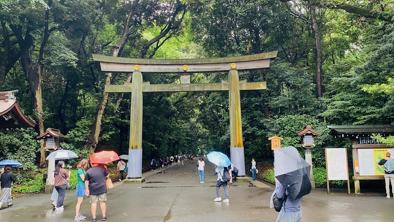
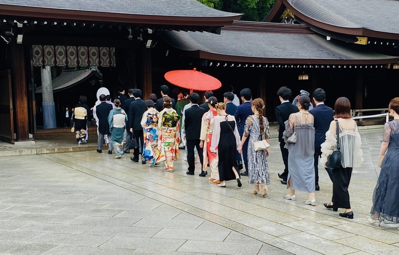
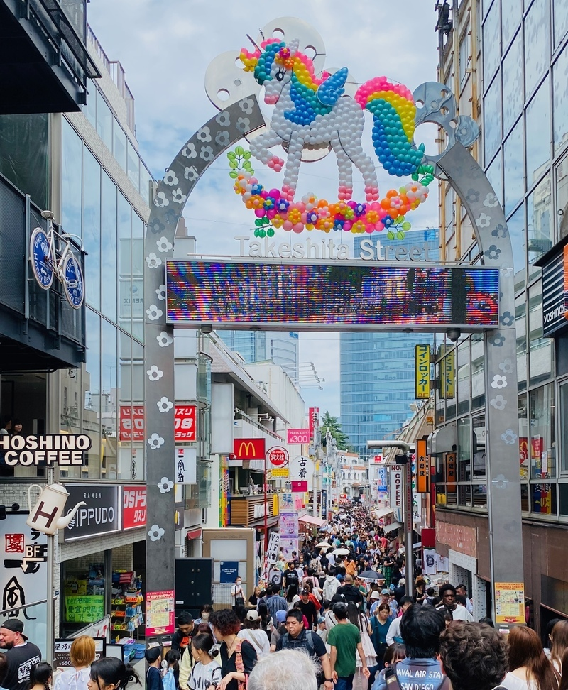
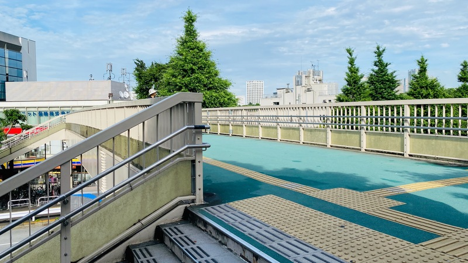
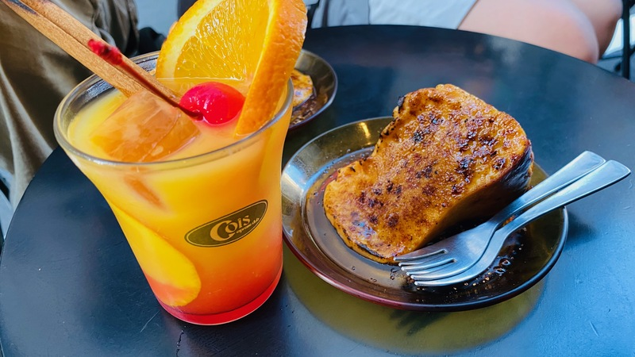
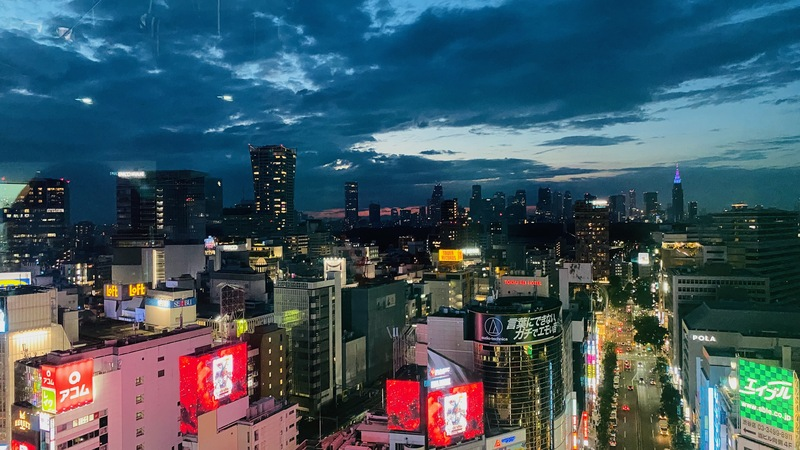

昨天已經晚了一個多小時出門，想當然的一天比一天還要更晚。
原本的行程規劃當中要先去賀須神社（朝聖「你的名字」電影當中的經典場景），
但比昨天有更晚出發，於是乎這個行程就取消了。今天的行程是往澀谷的方向前進，
距離我們住的地方，相較於前幾天稍遠一些的。

## 明治神宮

今天的第一個行程來到了明治神宮。跟昨天都市的行程對比，節奏明顯的變慢了不少。
在這種腳逛到要斷的狀態下，放慢節奏...  
只能說心靈上放鬆了不少，但沒地方坐，腳還是持續跟我抱怨著 QAQ

幸運的是，我們在神社當中遇到有人正在舉行婚禮，
新郎新娘穿著傳統的神前婚禮服裝，在神職人員的引導下緩緩前行。

## 竹下通

走出明治神宮之後，旁邊就是一條很熱鬧的接到，也就是「竹下通」。
裡面充滿了人潮，其實逛起來不是很舒服。在街道裡想買東西吃都會被排隊的人潮打退堂鼓。

逛了一圈之後，我們在附近找了一間鰻魚飯專賣店。

## 明治神宮外苑

雖然早上沒有去成賀須神社，朝聖電影的經典場景，但這個行程就是另一個場景了。
一群人到明治神宮外院旁的天橋拍了許久，還拿電影場景來對應著拍。

我們放慢了角度，在明治神宮外院逛了一圈。最後在附近找到了椅子坐下來休息。

就在這時，女朋友手機滑到一間小酒吧，
他看著照片中的甜點兩眼發光，於是我們起身前往這間小酒吧。  

到了小酒霸之後，現場沒有什麼位置可以讓我們 8 個人坐下來，稍等了大約十分鐘後，
店員很熱情的出來幫我們調整座位，讓我們可以坐下來，享受 Chill Chill 的下午。

## 澀谷 Sky

接近傍晚，我們前往澀谷 SKY。
這就是標準的觀光景點了，在 IG 上一直滑到，現在終於有機會來到。
我們在上面待了兩個多小時，最後在附近的涉谷橫町找到了一間店，來結束這一天的旅程。

