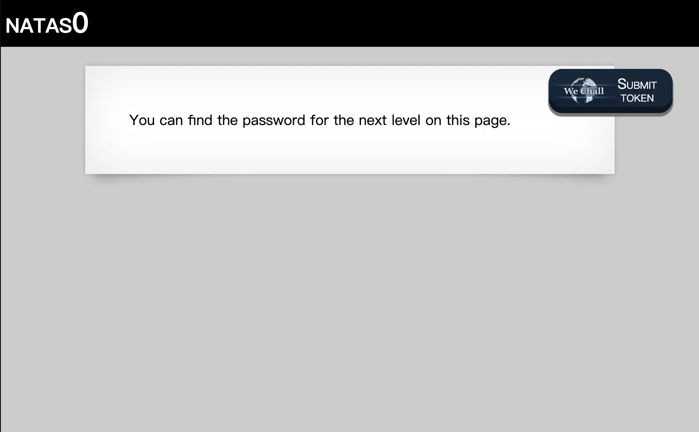
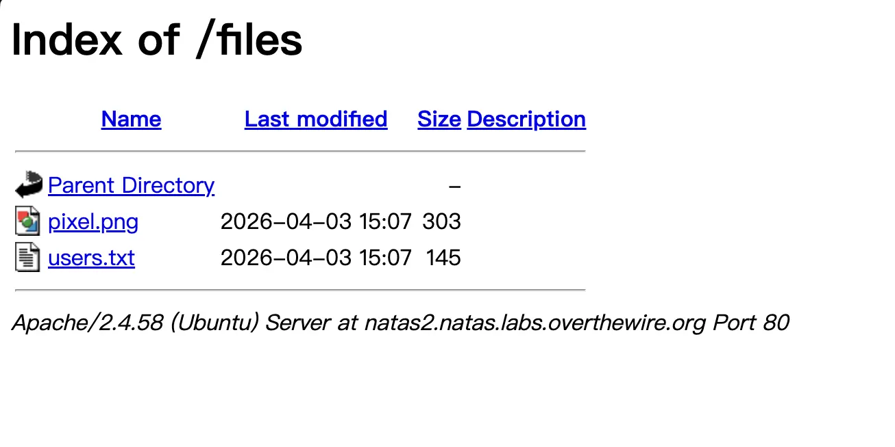

這張 cover 圖好像太花了，但今天的產圖額度用完了 QAQ

## 關於 [Natas](https://overthewire.org/wargames/natas/)

每個 Natas 關卡都對應一個獨立的網站，玩家需要使用當前關卡的帳號與密碼登入，我們有用盡各種手段，來找出下一關的密碼。Natas 每個關卡主要使用 Basic Authorization 作為驗證，帳號是 natas + \<關卡\>，密碼則是前一關找到的密碼啦！


### Basic Authentication

Basic Authorization（基本驗證）是 HTTP 協定中最簡單的一種身份驗證方式，用來限制使用者存取網站資源。它的核心概念很直接：**每次請求時都附帶帳號與密碼，讓伺服器驗證你是誰。**

他的傳送方式也很簡單，就是把 \<username\>:\<password\> 編碼為 Base64，並且放在 HTTP Header 當中：

```
Authorization: Basic base64(username:password)
```

## [Natas0](http://natas0.natas.labs.overthewire.org) -> Natas1

關卡 0 的描述頁面當中有帳號與密碼，分別是 `natas0` 與 `natas0`，透過瀏覽器打開的話，會有瀏覽器的提示要求輸入帳號密碼。



看到空空如也的介面，我想大部分對資訊領域的人類都會下意識地打開 Inspect 或是 source code，沒錯密碼就藏在 HTML 原始碼的註解當中，這關就算是解完了。

但這邊可以補充一下，我們可以用 `cURL` 的指令來完成請求，並直接看到原始碼：
```bash
$ curl -u natas0:natas0 http://natas0.natas.labs.overthewire.org
<html>
<head>
<!-- This stuff in the header has nothing to do with the level -->
<link rel="stylesheet" type="text/css" href="http://natas.labs.overthewire.org/css/level.css">
<link rel="stylesheet" href="http://natas.labs.overthewire.org/css/jquery-ui.css" />
<link rel="stylesheet" href="http://natas.labs.overthewire.org/css/wechall.css" />
<script src="http://natas.labs.overthewire.org/js/jquery-1.9.1.js"></script>
<script src="http://natas.labs.overthewire.org/js/jquery-ui.js"></script>
<script src=http://natas.labs.overthewire.org/js/wechall-data.js></script><script src="http://natas.labs.overthewire.org/js/wechall.js"></script>
<script>var wechallinfo = { "level": "natas0", "pass": "natas0" };</script></head>
<body>
<h1>natas0</h1>
<div id="content">
You can find the password for the next level on this page.

<!--The password for natas1 is ******************************** -->
</div>
</body>
</html>
```

## [Natas1](http://natas1.natas.labs.overthewire.org) -> Natas2

接著來到第 1 關，網站把滑鼠右鍵選單給擋住了，根據我之前在社團的經驗來看，我覺得對於大部分的人好像沒有影響，因為大家打開 Inspect 都是按 F12，好像也不用右鍵選單。在 Mac 上對於 Chromium 的使用者可以用 `opt` + `cmd` + `c` 來開啟，我也就不列舉各個系統與瀏覽器了，直接沿用 Natas0 的解法即可。

```bash
mirumo@ubuntu:~$ curl -u natas1:******************************** http://natas1.natas.labs.overthewire.org
<html>
<head>
<!-- This stuff in the header has nothing to do with the level -->
<link rel="stylesheet" type="text/css" href="http://natas.labs.overthewire.org/css/level.css">
<link rel="stylesheet" href="http://natas.labs.overthewire.org/css/jquery-ui.css" />
<link rel="stylesheet" href="http://natas.labs.overthewire.org/css/wechall.css" />
<script src="http://natas.labs.overthewire.org/js/jquery-1.9.1.js"></script>
<script src="http://natas.labs.overthewire.org/js/jquery-ui.js"></script>
<script src=http://natas.labs.overthewire.org/js/wechall-data.js></script><script src="http://natas.labs.overthewire.org/js/wechall.js"></script>
<script>var wechallinfo = { "level": "natas1", "pass": "********************************" };</script></head>
<body oncontextmenu="javascript:alert('right clicking has been blocked!');return false;">
<h1>natas1</h1>
<div id="content">
You can find the password for the
next level on this page, but rightclicking has been blocked!

<!--The password for natas2 is ******************************** -->
</div>
</body>
</html>
```

## [Natas2](http://natas2.natas.labs.overthewire.org) -> Natas3

來到關卡 2，一如既往的空空如也，好吧！看原始碼：


<html>
<head>
<!-- This stuff in the header has nothing to do with the level -->
<link rel="stylesheet" type="text/css" href="http://natas.labs.overthewire.org/css/level.css">
<link rel="stylesheet" href="http://natas.labs.overthewire.org/css/jquery-ui.css" />
<link rel="stylesheet" href="http://natas.labs.overthewire.org/css/wechall.css" />
<script src="http://natas.labs.overthewire.org/js/jquery-1.9.1.js"></script>
<script src="http://natas.labs.overthewire.org/js/jquery-ui.js"></script>
<script src=http://natas.labs.overthewire.org/js/wechall-data.js></script><script src="http://natas.labs.overthewire.org/js/wechall.js"></script>
<script>var wechallinfo = { "level": "natas2", "pass": "********************************" };</script></head>
<body>
<h1>natas2</h1>
<div id="content">
There is nothing on this page

</div>
</body></html>


這裡出現了一張位於 `files/pixel.png` 的圖片，因此可以合理猜測網站存在一個 `files/` 目錄。

許多早期網站若沒有正確關閉 Directory Listing（目錄列舉），直接存取目錄路徑時，伺服器就會列出該目錄底下的所有檔案。



這裡有一個 `user.txt` 的檔案，就不客氣地點進去看囉！

```txt
# username:password
alice:BYNdCesZqW
bob:jw2ueICLvT
charlie:G5vCxkVV3m
natas3:********************************
eve:zo4mJWyNj2
mallory:9urtcpzBmH
```
